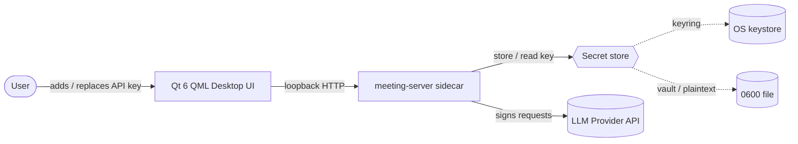
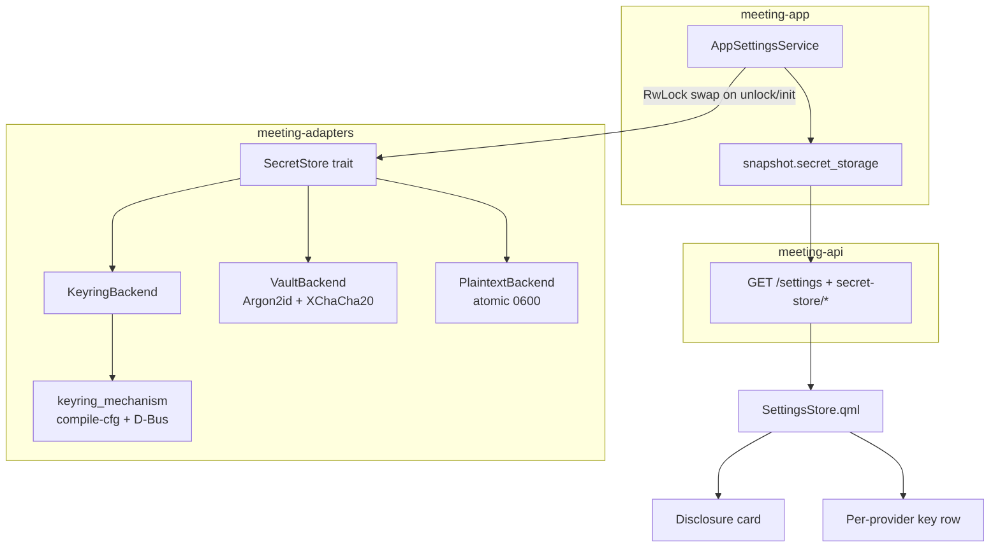
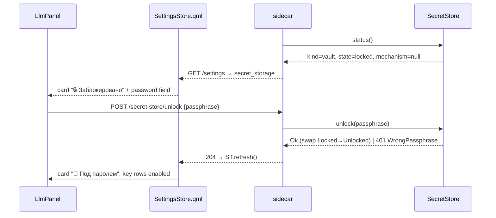

# Secret Storage — Architecture & Plan v1.0

Companion to `prd-v1.0.md`. Captures the C4 view, the ADRs behind the design,
the wire contract, the vault format, and the per-phase task breakdown.

## 1. Architecture (C4)

### Level 1 — System Context (unchanged, for orientation)



No new external actors. The OS keystore and the on-disk fallback file are the
only at-rest locations; nothing leaves the machine.

### Level 2 — Container / secret-store composition



### Level 3 — Unlock / disclosure flow



## 2. Decisions (ADRs)

### ADR-011 — Structured `secret_storage` replaces the `secrets_fallback` bool

**Context.** The snapshot already ships `secrets_fallback: bool` with one QML
consumer and one contract-test assertion. The disclosure goal needs more than a
bool: a state, a concrete mechanism, and an optional path.

**Decision.** Replace the bool with a structured object (below). One consumer
and one test migrate atomically. Mirrors the existing read-only `whisper_backend`
string idiom in the same JSON block.

**Consequences.** ＋ Single typed source of truth, extensible. − Breaking wire
change, but the only client is in-repo.

### ADR-012 — Expose the fallback file path

**Context.** Should the snapshot carry the real path to `secrets.json` /
`secrets.vault.json`?

**Decision.** Yes, only for `kind in {plaintext, vault}` (`null` for keyring).
The path is not itself a secret, it is deterministic from the config dir, and
surfacing it is the point — the user must know what to delete / harden. It rides
the same localhost-only sanitized channel as `has_key`.

**Consequences.** ＋ Actionable disclosure, enables "open folder". − Leaks a path
to anything that can already read `has_key`; no new exposure.

### ADR-013 — Passphrase vault as the encrypted fallback

**Context.** When the OS keystore is unavailable, "encrypted at rest without
user interaction" is impossible without a hardware root of trust (which the OS
keystore already wraps). The honest options are refuse / passphrase / plaintext.

**Options.**
- A — No fallback (refuse). Most secure, worst UX for dev builds.
- B — Passphrase vault. Real at-rest encryption; costs a passphrase prompt.
- C — Plaintext `0600` only. Current; leaks via backups, disk theft, sync.

**Decision.** Offer **B** as the recommended fallback, keep **C** behind an "I
understand the risk" choice, surface both honestly. Crypto: `argon2` (Argon2id,
OWASP-ish params, stored in file), `chacha20poly1305` (XChaCha20-Poly1305),
`zeroize` + `secrecy` for in-memory keys. Pure-Rust RustCrypto stack, no C deps.

**Consequences.** ＋ Closes backup/disk-theft/sync vectors. − Adds an unlock
state machine and "forgotten passphrase = lost keys" UX that must be explicit.

### ADR-014 — Surface the concrete keyring mechanism; fix the Linux mock

**Context.** Users want to see *which* keystore is used, not just "system safe".
But `keyring` is compiled **without** a Linux backend feature, so on Linux it
resolves to the in-memory mock; `probe_keyring()` succeeds against the mock and
the app falsely reports a working keystore. Naming "Secret Service" while using
the mock would be a lie, and keys silently do not persist.

**Decision.**
- Enable `keyring` feature `sync-secret-service` on Linux (pulls
  `dbus-secret-service` → system libdbus → real Secret Service). The blocking
  backend is chosen deliberately over the pure-Rust async/zbus one:
  `KeyringSecretStore` is called from async (axum) contexts, where a runtime
  blocking on a nested runtime would panic. libdbus-1 is already present
  wherever a Secret Service runs. This makes "Secret Service" truthful and keys
  persistent.
- `probe_keyring()` returns `false` when `KeyringMechanism::None` (no backend
  compiled) so disclosure stays honest and the app uses the fallback.
- Derive the mechanism from compile cfg + enabled feature; on Linux refine
  GNOME-Keyring vs KWallet at runtime via the owner of the D-Bus name
  (`org.kde.kwalletd*` ⇒ KWallet, else Secret Service).
- Backend emits a stable id; QML localizes the label.

**Consequences.** ＋ Honest, specific disclosure; fixes a latent persistence bug.
− One zbus dependency on Linux; one `ListNames` D-Bus call for the daemon detail.

## 3. Wire contract

`GET /api/v1/settings` snapshot gains (replacing `secrets_fallback`):

```jsonc
"secret_storage": {
  "kind":   "keyring" | "vault" | "plaintext" | "undecided",
  "state":  "ready" | "locked",                      // locked only for vault
  "mechanism":        "apple_keychain" | "windows_credential_manager"
                    | "secret_service" | "kwallet" | null,   // only when kind=keyring
  "mechanism_detail": "GNOME Keyring" | null,         // optional Linux daemon name
  "path":   "/home/.../secrets.vault.json" | null     // vault/plaintext only
}
// per-provider has_key is unchanged
```

New lifecycle endpoints:

| Method + path | Body | Result |
|---------------|------|--------|
| `POST /settings/secret-store/init` | `{mode:"vault"\|"plaintext", passphrase?}` | 204 |
| `POST /settings/secret-store/unlock` | `{passphrase}` | 204 / **401** |
| `POST /settings/secret-store/passphrase` | `{old, new}` | 204 / 401 |
| `POST /settings/secret-store/lock` | — | 204 |
| `POST /settings/secret-store/migrate` | `{to:"vault"\|"keyring", passphrase?}` | 204 |

`PUT /settings/secret` and `/settings/test` unchanged; return `409 Locked` when
the vault is locked so the UI prompts for the passphrase.

## 4. Vault file format

`secrets.vault.json`, `0600`, atomic write (temp + fsync + rename):

```jsonc
{
  "version": 1,
  "kdf":   { "alg": "argon2id", "salt": "b64", "m_cost": 19456, "t_cost": 2, "p_cost": 1 },
  "aead":  "xchacha20poly1305",
  "nonce": "b64",
  "ciphertext": "b64"   // encrypts {"anthropic":"sk-...","openai":"sk-..."}
}
```

- `key = Argon2id(passphrase, salt, params)`; decrypt → `BTreeMap` in a
  `secrecy::SecretBox`. Wrong passphrase ⇒ AEAD tag failure ⇒ `WrongPassphrase`.
- Each `set`/passphrase change re-encrypts with a fresh nonce (and fresh
  salt+key on passphrase change). KDF params live in the file for later
  strengthening.

## 5. Backend shape (Rust)

```rust
pub trait SecretStore: Send + Sync {
    fn status(&self) -> SecretStatus;                 // for the snapshot
    fn get(&self, provider: &str) -> Result<Option<String>, SecretError>;
    fn set(&self, provider: &str, value: &str) -> Result<(), SecretError>;
    fn delete(&self, provider: &str) -> Result<(), SecretError>;
}

pub enum SecretStatus {
    Keyring { mechanism: KeyringMechanism, detail: Option<String> },
    Vault { state: VaultState, path: PathBuf },
    Plaintext { path: PathBuf },
    Undecided,
}
pub enum VaultState { Locked, Unlocked }
pub enum KeyringMechanism {
    AppleKeychain, WindowsCredentialManager, SecretService, KWallet, None,
}
pub enum SecretError { Locked, WrongPassphrase, Io(std::io::Error) }
```

Composition holds `RwLock<Box<dyn SecretStore>>` so `unlock`/`init`/`migrate`
swap the active backend live (mirrors `SwappableLlm`). The GUI store has **no
ambient env-var override** — keys come only from what the user configured
(keyring/vault/plaintext), so the UI's `has_key` always reflects the real,
manageable state. (The separate headless CLI `generate` command still reads
`ANTHROPIC_API_KEY` explicitly — that is an opt-in Unix-style invocation, not a
hidden GUI override.)

## 6. UI

- **Disclosure card** — top of the LLM panel, global. Header = `🔒/🔑/⚠️` +
  state label + (keyring only) `"  ·  " + mechanismLabel(mechanism, detail)`.
  Actions per state: keyring → none; vault-unlocked → change passphrase / lock;
  vault-locked → password field + unlock; plaintext → "protect with passphrase"
  / "open folder" (`Qt.openUrlExternally`, precedent in WhisperPanel).
- **Per-provider key row** ([LlmPanel.qml:181-298](../../../qt-app/qml/screens/settings/LlmPanel.qml#L181-L298))
  — masked current key, replace, test, delete already exist. Make the help text
  conditional on `secret_storage`; disable the row with a hint when
  `state == locked`.
- **Dialogs** (`MeetyDialog`) — mode choice (first key with no keystore), create
  /enter passphrase (with "no recovery" warning), unlock on start.

`mechanismLabel` id→label table lives in QML (i18n), not Rust:
`apple_keychain`→«Связка ключей macOS», `windows_credential_manager`→«Диспетчер
учётных данных Windows», `secret_service`→«Secret Service (detail)»,
`kwallet`→«KDE KWallet».

## 7. Task breakdown

Status: **Phases 1–4 done (feature complete)** on branch
`feat/secret-storage-disclosure`.
Phase 2 ships the keyring/plaintext card; `mechanism_detail` (runtime
GNOME-vs-KWallet) is deferred — the card shows "Secret Service" without the
daemon name until then. Phase 3 ships the passphrase vault (protect / unlock /
lock / change-passphrase) with the in-card unlock and the passphrase dialog.

Phase 3 deviations from the original sketch (deliberate):
- **No `Undecided` state / no first-key mode dialog.** When the keyring is
  unavailable the store defaults to plaintext (keys work immediately, disclosed)
  and the user upgrades via "Защитить паролем" → plaintext→vault migration. This
  drops a blocking first-run choice for a simpler flow.
- **Single-type multi-mode store, not a `dyn SecretStore` trait.** The existing
  `KeyringSecretStore` already encapsulates backend selection; vault is a fourth
  internal `Inner` mode behind its `Mutex`. Avoids churning all call sites for an
  abstraction with one impl.
- **`set`/`delete` return an `io::Error` when locked (HTTP 400), not 409.** The
  UI gates writes while locked, so the status code is cosmetic; left as a refinement.
- **Linux Secret Service via `dbus-secret-service` (libdbus), not zbus** — see ADR-014.

Phase 4 deviations/notes:
- **plaintext→keyring is automatic** at startup (no passphrase needed): stale
  plaintext keys are folded into the keystore (without clobbering existing ones)
  and the file is deleted only once they are safely imported.
- **vault→keyring is user-driven** (needs the passphrase): when the keystore is
  back but a vault lingers, the snapshot reports `pending_migration: "vault"` and
  the keyring card shows an inline "Перенести в системный сейф" prompt.
- **reset-store** is the forgotten-passphrase escape hatch (keys lost),
  surfaced as "Забыли пароль?" in the locked card with a confirm dialog.

### Phase 1 — Honest contract + hardening
- `secret_store.rs`: atomic `0600` write (temp+fsync+rename), config dir `0700`.
- Linux: add `keyring` feature `sync-secret-service`; `keyring_mechanism()`;
  `probe_keyring()` ⇒ false on `Mechanism::None`.
- `settings_service.rs`: emit `secret_storage` (replaces `secrets_fallback`).
- `sidecar_contract.rs`: assert on `secret_storage.kind`.
- `SettingsStore.qml`: `secretStorage()` accessor; update shape comment.
- `LlmPanel.qml`: conditional help text (stop claiming "Keychain").

### Phase 2 — Disclosure card
- Add the card; `MeetyTag` warn-variant (`Theme.warn`) for plaintext.
- Optional: runtime GNOME-vs-KWallet `mechanism_detail`.

### Phase 3 — Passphrase vault
- `VaultBackend` + format; `SecretStore` trait + `RwLock` swap.
- init/unlock/lock/passphrase endpoints + routes; `409 Locked` on secret/test.
- Dialogs + locked-state UI.

### Phase 4 — Migrations
- plaintext→vault, vault→keyring, "reset store"; clean up stale plaintext when
  a keystore appears.

## 8. Risks

- **Forgotten passphrase = unrecoverable keys.** Mitigate with explicit UI copy
  and a "reset store" escape hatch.
- **Locked vault blocks protocol generation.** Surface as a clear "unlock"
  prompt, not an opaque 409.
- **Per-OS wording drift.** Verify the card text on macOS / Windows / GNOME /
  KDE before closing each phase (success criterion in the PRD).
