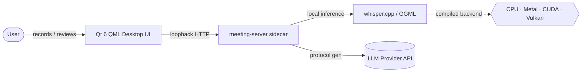
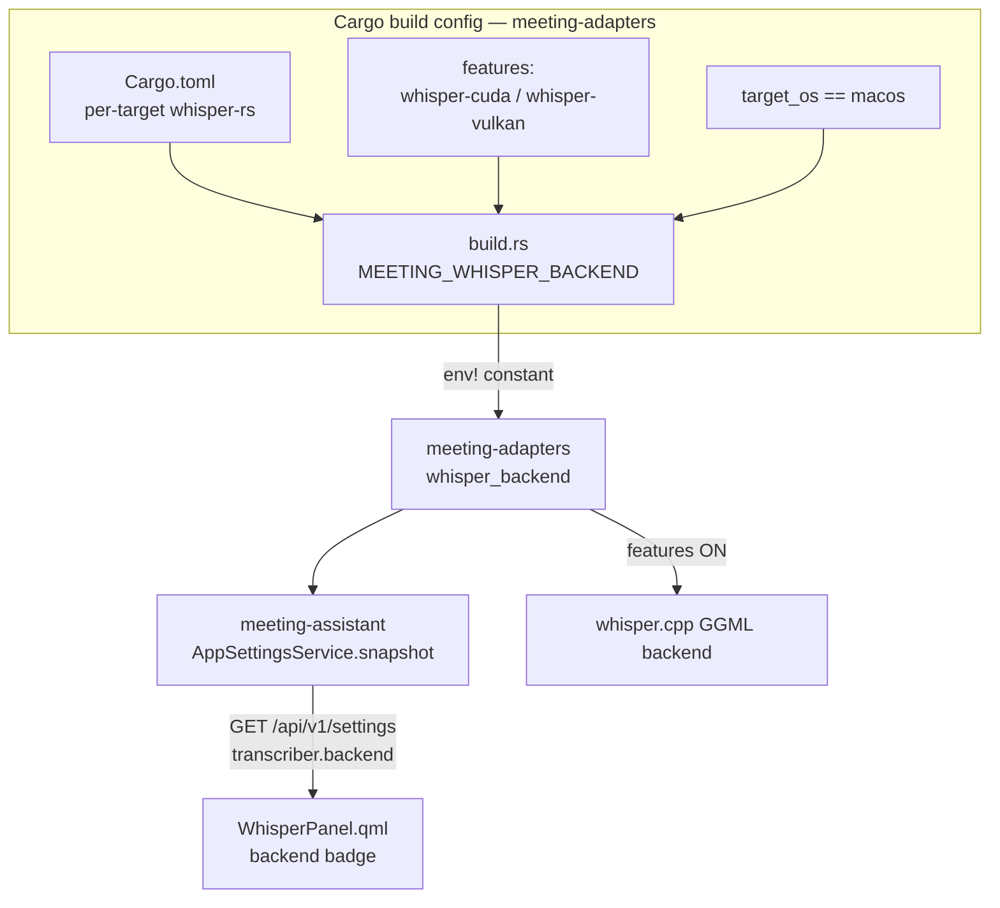
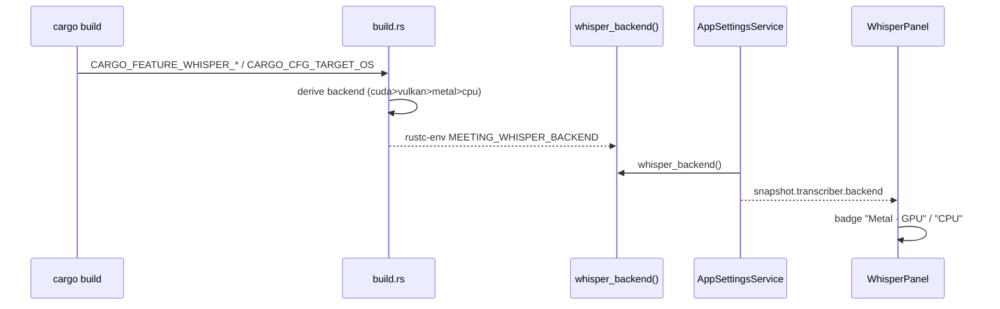

# Whisper GPU Acceleration — Architecture & Plan v1.0

Companion to `prd-v1.0.md`. Captures the C4 view of the change, the ADRs behind
it, and the benchmark harness used to record the speedup.

## 1. Architecture (C4)

### Level 1 — System Context (unchanged, for orientation)

The acceleration change lives entirely inside the sidecar's transcription path
and its compile configuration. No new external actors, no new network surface.

### Level 2 — Container / build configuration

### Level 3 — Component flow of the backend signal

## 2. Decisions (ADRs)

### ADR-006 — macOS defaults to Metal; CUDA/Vulkan are opt-in features

**Context.** `whisper-rs` exposes `metal`, `cuda`, `vulkan` (and others) as
cargo features. Features apply uniformly across targets, so a single global
feature that enables `whisper-rs/metal` would also try to compile Metal on Linux.
The packaging pipeline must keep producing a portable CPU build, and macOS
signing/notarization must not gain new surface.

**Options.**
1. One global `whisper-accelerate` feature mapping to `whisper-rs/metal`.
   *Rejected:* breaks non-macOS builds (Metal won't compile there) and forces
   every consumer to know the per-OS feature matrix.
2. Per-target dependency tables: macOS gets `whisper-rs` with `metal`, everyone
   else gets plain `whisper-rs`; CUDA/Vulkan as opt-in `[features]`. *Chosen.*
3. Runtime backend selection (load all backends, pick at startup). *Rejected:*
   whisper.cpp links a backend at build time; this is not how GGML works.

**Decision.** Declare `whisper-rs` in `[target.'cfg(target_os = "macos")']`
with `features = ["metal"]` and in `[target.'cfg(not(target_os = "macos"))']`
plain. Add `whisper-cuda = ["whisper-rs/cuda"]` and
`whisper-vulkan = ["whisper-rs/vulkan"]`, both off by default.

**Consequences.**
- (+) macOS gets the cheapest win out of the box; portable build unchanged;
  Linux/Windows users opt in with one flag when they have the SDK.
- (+) Metal is a system framework → no extra notarization/signing surface.
- (−) macOS always links Metal; there is no feature to force a pure-CPU macOS
  build. Acceptable: Metal is present on every supported Mac and falls back
  safely. Revisit only if a CPU-only macOS build is ever needed for debugging.
- (−) Building with a GPU feature requires the matching SDK (CUDA/Vulkan)
  installed; failures surface in `whisper-rs-sys`'s cmake step, not our code.

### ADR-007 — Report the *compiled* backend, derived in build.rs

**Context.** The UI must show whether the user got the accelerated path. We need
a single source of truth that cannot drift from what was actually linked.

**Options.**
1. Live device probe via `whisper.cpp` system-info (`raw-api`). *Rejected for
   now:* needs the `raw-api` feature and FFI string parsing; higher fidelity but
   more surface. The compiled backend is what users actually care about ("did my
   build get GPU?").
2. Read the dependency's enabled features from our own crate. *Rejected:* Cargo
   doesn't expose a dependency's active features to dependent code.
3. Derive the backend in `build.rs` from `CARGO_FEATURE_*` + `CARGO_CFG_TARGET_OS`
   and emit it as a `rustc-env` constant. *Chosen.*

**Decision.** `build.rs` computes `cuda > vulkan > metal(macOS) > cpu` and emits
`MEETING_WHISPER_BACKEND`; `whisper_backend()` returns `env!(...)`. This mirrors
the exact policy in `Cargo.toml`, so the two stay in lockstep (the only coupling
point, documented in both files).

**Consequences.**
- (+) Authoritative, zero-runtime-cost, no FFI.
- (−) Reports the *linked* backend, not a live device check: a `cuda` build on a
  host with no driver still reports `cuda` while whisper.cpp silently runs on
  CPU. Documented on `whisper_backend()`. A future live probe (option 1) can
  refine this without changing the public shape.
- (−) The macOS→metal rule is duplicated (Cargo.toml + build.rs). Mitigated by
  a comment in each pointing at this ADR.

### ADR-008 — Surface the backend as a read-only field in the settings snapshot

**Context.** The WhisperPanel already consumes the settings snapshot (and
`/api/v1/transcription-models`). The backend is read-only, not user-editable.

**Decision.** Add `transcriber.backend` to the snapshot JSON. The QML draft is a
deep copy of the snapshot and is PUT back wholesale on save; `PersistedSettings`
(and its wire struct) do not declare `backend` and do not use
`deny_unknown_fields`, so serde silently drops it on PUT. Precedent:
`secrets_fallback` is already a read-only snapshot field.

**Consequences.**
- (+) No new endpoint; reuses the screen's existing data flow.
- (+) Round-trip-safe (proved by `settings_get_put_roundtrip_and_secret_flag`).
- (−) The field rides inside the editable `transcriber` object; mitigated by a
  comment in `settings_service.rs` and the round-trip test.

### ADR-009 — Runtime `use_gpu` toggle reloads the context

**Context.** The backend *type* is link-time (ADR-006), but whisper.cpp exposes
a runtime `whisper_context_params.use_gpu`. Users on accelerated builds may want
to force CPU (debugging, thermal throttling, GPU contended by another app).

**Decision.** Add `TranscriberPrefs.use_gpu` (default `true`). It is a
*context-creation* parameter, so it is threaded into the `RunnerFactory`
(`Fn(&Path, bool)`) rather than the per-call `FullParams`. `LazyState` records
the `use_gpu` the loaded runner was built with; on the next acquire a mismatch
triggers a reload — but only when `active_count == 0`, so a toggle never swaps a
context out from under an in-flight transcription. On CPU-only builds the flag is
inert (whisper.cpp has nothing to offload) and the UI switch is disabled.

**Consequences.**
- (+) Reuses the existing lazy load/unload machinery; no new restart-required
  setting; hot-applied like language/beam/threads.
- (+) `WhisperContextParameters::default().use_gpu` is already `cfg!(_gpu)`, so
  the default matches the compiled build; the toggle only ever *narrows* it.
- (−) First transcription after a toggle pays one model reload. Acceptable —
  it's a rare, explicit user action.

### ADR-010 — CPU-only builds show an honest, plain-language note (no hardware probe)

**Context.** The toggle is meaningful only on an accelerated build (ADR-006/009).
On a CPU-only build it must be disabled — but *what* it says matters. The first
attempts were either dead-ends ("build has no GPU support") or dev jargon
("нужна сборка с CUDA/Vulkan"), which an end user cannot act on. "What to do" is
only honest if there is something the user can actually do.

**Options.**
1. Detect the GPU vendor (sysfs PCI IDs / Metal) and tell the user to "get a
   CUDA/Vulkan build". *Rejected:* there is no such downloadable build today, so
   this teases a capability and leaks build-system jargon. Detection code became
   dead weight the moment the message couldn't point anywhere.
2. Runtime device probe via GGML enumeration (`raw-api`). *Rejected (now):* same
   "nowhere to send the user" problem, plus unsafe FFI cost.
3. Report only the compiled `backend`; on CPU builds show one honest,
   plain-language sentence and no false promise. *Chosen* (product decision: GPU
   in a shipped build is "not supported yet" — see ADR-011).

**Decision.** The snapshot exposes only read-only `transcriber.backend`. The UI
offers the toggle iff `backend !== "cpu"`; otherwise it is disabled with:
> «Транскрипция выполняется на процессоре. Ускорение на видеокарте в этой версии
> пока не поддерживается.»

No GPU-vendor detection ships. The earlier `gpu.rs` / `gpu_detected` / `gpu_supported`
work was removed as dead code once option 1 was rejected.

**Consequences.**
- (+) Honest and clear for a non-technical user; no jargon, no broken promise.
- (+) Less code — backend reporting alone; `backendAccelerated()` derives from it.
- (−) The message is uniform regardless of installed hardware; when a GPU build
  is actually shipped (ADR-011) this copy + a vendor hint should be revisited.

### ADR-011 — Ship Vulkan as the accelerated Win/Linux build (future)

**Context.** ADR-010's "not supported yet" is the honest status precisely because
no GPU build is distributed. The path to changing that: CUDA needs the end user's
machine to have built with the CUDA Toolkit and is NVIDIA-only; that does not
scale to a shipped product.

**Options.** CUDA-only power build · **Vulkan as the default accelerated build** ·
per-vendor builds (CUDA+ROCm+oneAPI).

**Decision (proposed, not yet executed).** Ship **one Vulkan build** as the
accelerated Win/Linux artifact: it runs on NVIDIA/AMD/Intel through the driver's
Vulkan ICD with no end-user SDK, only the (ubiquitous) Vulkan loader at runtime.
Keep CUDA as an optional power build for NVIDIA users who want maximum speed;
macOS stays Metal.

**Consequences.**
- (+) One artifact covers most discrete GPUs; once it ships, ADR-010's "not
  supported yet" copy can change to "download the GPU build" (with a vendor hint).
- (−) Vulkan is slower than CUDA for Whisper; power users still want CUDA.
- (−) Adds a packaging lane (Vulkan SDK / `glslc` on the build runner). Tracked
  separately from this task.

## 3. Benchmark harness

Per the backlog, record the speedup against a reference 60-minute WAV for
posterity. The transcriber already emits structured timings to
`~/.local/share/meeting-assistant/transcription.log`
(`model_loaded … backend=<b>`, `inference_done … rtf=<x>`).

**Method.**
1. Prepare a 60-min, 16 kHz mono reference WAV (a fixed public-domain recording).
2. CPU baseline (any OS, default build):
   `cargo build --release -p meeting-assistant` → transcribe → read `rtf`.
3. macOS Metal (default build on M-series): same steps; Metal is automatic.
4. CUDA (Linux + CUDA SDK):
   `cargo build --release -p meeting-assistant --features meeting-adapters/whisper-cuda`.
5. Compare `inference_done … rtf` and total wall-clock for the same model
   (`large-v3-turbo` recommended) and `beam_size`.

**Results** (RTF = inference_seconds / audio_seconds; lower is faster):

| Host | Backend | Model | beam | RTF | 60-min wall-clock | Speedup vs CPU |
|---|---|---|---|---|---|---|
| _TBD M-series_ | metal | large-v3-turbo | 1 | _TBD_ | _TBD_ | _TBD_ |
| _TBD NVIDIA_ | cuda | large-v3-turbo | 1 | _TBD_ | _TBD_ | _TBD_ |
| _this Linux box_ | cpu | large-v3-turbo | 1 | _TBD_ | _TBD_ | 1.0× |

> The Metal/CUDA rows require macOS / NVIDIA hardware not available in the
> development environment where this was implemented (Linux, CPU). Fill these in
> before the closing commit (see PRD closing step).

## 4. Rollout / packaging notes

- Default CI and portable packaging: no change — CPU on Linux/Windows, Metal on
  macOS (automatic, no flag).
- To ship a CUDA build: add `--features meeting-adapters/whisper-cuda` to the
  release build on a runner with the CUDA toolkit; keep it a separate artifact.
- The badge in WhisperPanel lets QA confirm at a glance which backend a given
  build shipped with.
