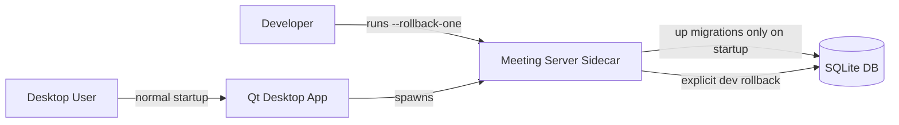
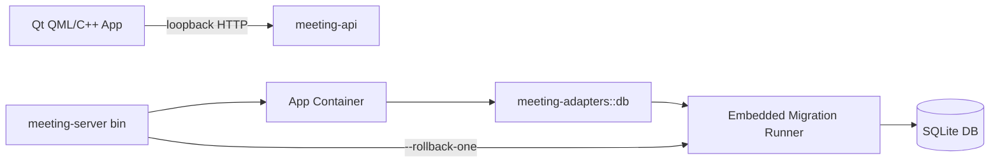

# Reversible SQLite Migrations

## Problem

[`rust/migrations/`](../../rust/migrations/) holds six forward-only `.sql` files.
A schema mistake ships a one-way change; the only recovery path today is writing
a compensating forward migration, which is awkward during development when
iterating on a new column.

## Scope

In:

- Keep the existing `001`-`006` migrations as a forward-only shipped baseline.
- Extend the internal `rusqlite` migration runner so future migrations can carry
  an optional `down` SQL pair.
- Add a dev-only `meeting-server --rollback-one` command that opens the default
  sidecar DB and rolls back the latest applied migration only when that
  migration has a bundled `down` SQL.
- Add regression tests for applying optional-down migrations and rollback edge
  cases.

Out:

- Rewriting existing migration filenames.
- Pulling in a third-party migration framework before the local runner is
  demonstrably insufficient.
- Exposing rollback through HTTP or Qt UI.
- Supporting production automatic rollback.

## Architecture

### C4 Level 1: Context



### C4 Level 2: Container



### C4 Level 3: Component

```mermaid
flowchart TB
    DbOpen[Db::open] --> Apply[apply_migrations]
    RollbackCli[meeting-server --rollback-one] --> RollbackPath[rollback_last_migration_at_path]
    Apply --> Registry[MIGRATIONS: Migration { version, up, down }]
    RollbackPath --> Rollback[rollback_last_migration]
    Rollback --> Registry
    Apply --> SchemaVersion[_schema_version]
    Rollback --> SchemaVersion
```

## Deliverables

- [`rust/crates/adapters/src/db/mod.rs`](../../rust/crates/adapters/src/db/mod.rs):
  migration metadata with optional down SQL, rollback function, and unit tests.
- [`rust/crates/app/src/bin/meeting-server.rs`](../../rust/crates/app/src/bin/meeting-server.rs):
  parse and execute `--rollback-one` before sidecar startup.
- Test plan: run `cargo test --manifest-path rust/Cargo.toml -p meeting-adapters db::tests`.

## Decisions

### ADR: Keep a local rusqlite migration runner

Context: the current runner is small, embedded, and already aligned with the
desktop sidecar packaging model. The immediate requirement is optional local
rollback for future migrations, not a general migration-management product.

Options:

- Keep the local runner and add optional `down` support.
- Adopt `refinery`.
- Adopt `rusqlite_migration`.

Decision: keep the local runner. It avoids new dependency and packaging surface,
preserves existing behavior, and keeps rollback gated to an explicit CLI path.

Consequences:

- Positive: production startup remains unchanged and simple.
- Positive: future migrations can add `NNN_name.up.sql` / `NNN_name.down.sql`
  entries by wiring both into the embedded registry.
- Negative: contributors must still add one line to the registry for new
  migrations.
- Risk: no broad migration-framework features yet; revisit only when migration
  volume or operational needs outgrow the local runner.
